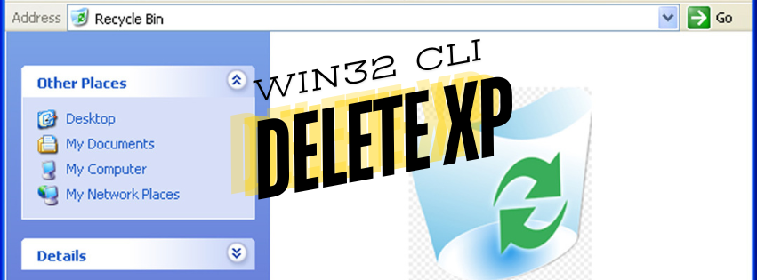

# DeleteXP
For moving deleted files from Command Prompt in Windows to Recycle Bin.

Delete XP is for deleting files from Command Prompt in Windows (Windows 9x and Windows NT 4.0/2000/XP). Unlike, the standard “DEL” command which only deletes the file, Delete XP deletes the files and sends them to the recycle bin. In my opinion, this is what DEL command in the command prompt of Windows should have been!.

# Download
The Executable (.exe) file was built around in 2000 with the then available Windows SDK. This ready-to-use binary is available in the release folder. I have made some changes in the source code (.CPP) file with the display text, but otherwise the functionality should be the same from the original sourceode from which the binary was generated. 

### DeleteXP.exe
Filesize: 61440 bytes

SHA256 Hash: 3782FD00DA1B172279DFA988FE351A6857E801AE48D5CDCD7D858B424D025FBB 

Powershell cmdlet to verify the hash: 
`Get-FileHash -Path "deletexp.exe" -Algorithm SHA256`

# First Release on 1997
First Release was on March 15,1997 as Delete '97 as a freeware. 

# Introduction written around 2000
Delete ’97 and subsequent Delete XP has been one of the popular command line utility that I wrote & made available for free! 

This was one of my favourite Win32 Console applications that I wrote, it was interesting and challenging at the same time to handle correctly the various command-line parameters (and their combinations) – which like those of you who have programmed on good ol’ C++ know, was by itself a daunting task. Over the years, the usage (familiarity and the need) of command prompt has certainly diminished. The only folks who uses it are the “IT Pros” and Me!. Anyways, even now I get once in a month or so, an email from some user across the world, who has found the tool on the Internet and finds it useful. They write to me with a bug/feature (I leave which is more to your imagination) requests.

# Comments Received
Reproducing below some of the comments I got in the first year of release of this program:

1. Lockergnome Windows 95/NT Distribution List (18 February 1997) – Issue #31
Microsoft made a mistake with the “delete” function from the command prompt–it doesn’t put the deleted files in yr Recycle Bin. Instead, it completely removes them–without some type of backup or data recovery system, they’ll be lost forever. That is, unless you download this FREE utility which allows you to delete files from the command prompt and put them in yr Recycle Bin! Long file names are accepted (if put within quotes), 32bit API calls are coded into the proggie, and the Recycle Bin icon now refreshes after a “delete” with this proggie has been made. You cannot live without this one, gang–honestly. It works with both 95/NT, so every one of you should be happy. I know I am.

1. DOWNLOAD.COM Description: Delete 97 is for deleting files from the DOS box, in Windows 95 and NT 4.0. Delete 97 deletes the files and sends them to the recycle bin. This is, perhaps, what Del command in MSDOS box of Windows 95 and NT should have been.

1. Date: Fri, 21 Feb 1997 23:39:06 -0500.
Subject: DELETE
Thanks for the delete utility. I just installed it on my machine. I also added a line to my autoexec to “alias” the standard Windows95 del command.
doskey del=c:\utility\delete $1 $2 $3 $4 $5 $6 $7 $8 $9
Hope you like the suggestion.
– Grey Smith

1. Date: Sat, 22 Mar 1997 16:35:20 +0100.
Subject: World needs men like you. Thanks.
Sincerely, Thank for your utility.
– From Spain. David E.

1. Date: Thu, 13 Mar 1997 15:50:36 -0500.
Subject: DELETE 97
Hi, great utility (delete 97). Here is a tip for 4DOS users, by issuing the 4DOS command > SETDOS /i-del < DEL)! of instead (DELETE command the relearn to have don’t you since great is This command. internal software delete97 uses automatically it DEL type time each Now directory. PATH a in put and DEL.EXE rename next command, del dissable
Thanks for the great utility
— Nelson Clark

1. Date: Thu, 13 Mar 1997 12:17:13 +0100.
Subject: Delete.exe
Thanks – very intelligent solution, don’t know why all the clever and well-payed people didn’t come across to make “del” so usable.
I am very surprised that you are from India – this is the first program from India I have ever seen.
Cheers!
Jaromir Vicari
Czech Republic

1. Date: Thu, 6 Mar 1997 11:25:25 -0500.
Subject: Re: Delete
I really enjoy your Delete program, have you considered doing a deltree replacement?
Darryl

1. Date: Thu, 13 Mar 1997 12:01:42 -0500.
Subject: Delete
Nice utility. I will be passing it to my friends.
By the way, I live outside of Syracuse, New York, USA and found the utility at PC Worlds’ Web site.
D. V. Gardner

1. Date: Tue, 18 Mar 1997 21:35:04 -0500 (EST).
Subject: Re: Delete97
Delete 97 was mentioned on the Internet Newsgroup for Windows 95. Once again, thanks. When I first switched to Windows 95 I was unaware that deleting from DOS would kill the files altogether; I had thought they’d go to the recycle bin (as indeed they should have).
I lost some data at that time, and am now delighted to be able to correct this source of error.
– Lee

1. Date: Wed, 19 Mar 97 15:42:10 PST.
Subject: Delete97!
First off, I love your Delete97 tool! I am trying to get into the habit of using Delete97 all the time to erase files, but have ran into one small glitch.
Currently, I am using it with a DOSKEY alias so that when I type ‘Erase’ or ‘Del ‘ on the command line, it runs Delete97.exe for me instead. The problem I run i nto, is that if I try to delete a file off a LAN drive, Delete97 can’t do it for me, giving an error that ‘Remote drives are not supported’.
Once again: Great tool. Thanks.
— Steve

1. Date: Fri, 14 Mar 97 17:18 +0100.
Subject: Delete 97
I have downloaded your program Delete 97. In my opinion, it is really great! I have one suggestion to improve the program: you can add the following doskey commands to the autoexec.bat:
DOSKEY DEL=DELETE $*
DOSKEY /ECHO:OFF
If you add this, it cannot happen that you type DEL instead of DELETE and delete the files irreversibly. Maybe you could mention this in your readme file.
Regards
Georg Burkhard

1. Date: Mon, 24 Feb 1997 12:14:53 -0500.
Subject: Delete
I just recently started using your delete program and really like it. I find it difficult to believe that Microsoft didn’t do this already.
Darryl Olthoff

1. Date: Sun, 23 Feb 1997 21:13:51 -0600.
Subject: Undelete?
Your delete 97 program is very convenient!
Ron Wencel
Northern Illinois University

1. Date: Fri, 7 Feb 1997 09:32:12 -0800 (PST).
Subject: Delete97.exe
Hi!! I downloaded Delete97 last night and tried it out on two WIN95 machines… it is indeed much faster, and I like the new options that you added for “ignore attributes” and multiple filespecs; it is VERY nice!!!
Thank you for the excellent improvements that you’ve made in this really cool program!!
Dan Miller

1. Date: Sun, 09 Feb 1997 03:23:49 +0530.
Subject: hi there :)
hi! :) wonderful utility u have here… i’m talkin bout delete97 ..its awesome… btw, where in chennai r u ? as for me, i’m in delhi and its real great 2 see such a wonderful program :) thanx againDate: Sat, 1 Feb 1997 19:34:24 +0100
Subject: delete.exe
Your delete.exe is great!
Just what I was looking for.
Thanks!
Hugo Carvalho